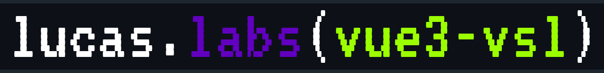

<p align="center"></p>

<p align="center">
<strong>
🔎 <code>@lucas-labs/vue3-vsl</code> (virtual-scroll-list) is a Vuejs 3 component plugin. Heavily based on <a href="https://github.com/tangbc/vue-virtual-scroll-list">tangbc/vue-virtual-scroll-list</a>. Basically the same but ported to Vuejs 3 + typescript + Composition API.
</strong>
</p>

## Install

### npm
```bash
npm i @lucas-labs/vue3-virtual-scroll-list
```

### pnpm
```bash
pnpm i @lucas-labs/vue3-virtual-scroll-list
```

### yarn
```bash
yarn add @lucas-labs/vue3-virtual-scroll-list
```

## Usage

```vue
<template>
    <header>hello!</header>

    <virtual-scroller :data-key="'id'" :data-sources="users" @tobottom="bottom">
        <template #header>
            <div class="list-header">...</div>
        </template>

        <template v-slot="{ item, index }">
            <div class="list-item">
                <div>#{{ index }}</div>
                <div>{{ item.id }} | {{ item.username }}</div>
            </div>
        </template>

        <template #footer>
            <div class="list-footer">...</div>
        </template>
    </virtual-scroller>
</template>

<script setup lang="ts">
    import { ref } from 'vue';
    import VirtualScroller from './components/VirtualScroller.vue';

    const users = ref<{ id: number | string; username: string }[]>([]);

    const fetchUsers = () => {
        users.value = ...
    };

    const bottom = () => {
        // we reached the bottom of the list...
        // fetch more users maybe?
        ...
    };

    fetchUsers();
</script>
```

### Use globally

```typescript
// main.ts/main.js
import { createApp } from 'vue'
import App from './App.vue'

// import the plugin
import VirtualScrollerPlugin from '@lucas-labs/vue3-vsl';

const app = createApp(App);

// use the plugin to make it 
// available in all your components
app.use(VirtualScrollerPlugin);
app.mount('#app');
```

# TODO

- [ ] Add tests!